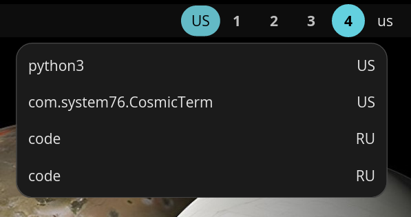

# cosmic-ext-applet-per-app-layout

A [COSMIC](https://github.com/pop-os/cosmic-epoch) panel applet that remembers keyboard layout for each application.



## Problem

COSMIC Desktop uses a single global keyboard layout. When you switch between
applications, the layout stays the same — so if you are typing in Russian in
one app and switch to a terminal, you have to change the layout manually.

This applet fixes that by automatically saving and restoring the keyboard layout
per application window.

## Features

- Automatic per-window keyboard layout tracking
- Layout restored on window focus
- Detects manual layout changes via polling
- Persists layouts across restarts (per `app_id` via `cosmic-config` state)
- Panel button shows the current active layout
- Popup with a list of remembered applications
- Multi-monitor support with focus event deduplication
- `--register` / `--unregister` CLI flags for panel management
- Internationalization support (i18n via Fluent)

## Requirements

- [COSMIC Desktop Environment](https://github.com/pop-os/cosmic-epoch)
- Rust 1.82+ (stable) — only for building from source

## Installation

### Arch Linux (AUR)

[](https://aur.archlinux.org/packages/cosmic-ext-applet-per-app-layout-bin)

```sh
git clone https://aur.archlinux.org/cosmic-ext-applet-per-app-layout-bin.git
cd cosmic-ext-applet-per-app-layout-bin
makepkg -si
```

### Pre-built binary

Download the latest release from
[GitHub Releases](https://github.com/utrumo/cosmic-ext-applet-per-app-layout/releases),
then extract and install:

```sh
tar xzf cosmic-ext-applet-per-app-layout-v*.tar.gz
sudo install -Dm0755 cosmic-ext-applet-per-app-layout /usr/bin/cosmic-ext-applet-per-app-layout
sudo install -Dm0644 io.github.utrumo.CosmicExtAppletPerAppLayout.desktop /usr/share/applications/io.github.utrumo.CosmicExtAppletPerAppLayout.desktop
sudo install -Dm0644 io.github.utrumo.CosmicExtAppletPerAppLayout-symbolic.svg /usr/share/icons/hicolor/scalable/apps/io.github.utrumo.CosmicExtAppletPerAppLayout-symbolic.svg
cosmic-ext-applet-per-app-layout --register
killall cosmic-panel
```

### From source

```sh
git clone https://github.com/utrumo/cosmic-ext-applet-per-app-layout.git
cd cosmic-ext-applet-per-app-layout
make build
sudo make install
```

This installs the binary to `/usr/bin`, registers the applet in the panel,
and restarts the panel automatically.

### Packaging

```sh
make build
make DESTDIR=/tmp/pkg install
```

When `DESTDIR` is set, panel registration is skipped — the package manager
should handle that.

### Uninstall

AUR:

```sh
sudo pacman -Rsn cosmic-ext-applet-per-app-layout-bin
```

From source:

```sh
sudo make uninstall
```

Pre-built binary:

```sh
cosmic-ext-applet-per-app-layout --unregister
sudo rm /usr/bin/cosmic-ext-applet-per-app-layout
sudo rm /usr/share/applications/io.github.utrumo.CosmicExtAppletPerAppLayout.desktop
sudo rm /usr/share/icons/hicolor/scalable/apps/io.github.utrumo.CosmicExtAppletPerAppLayout-symbolic.svg
rm -rf "${XDG_STATE_HOME:-$HOME/.local/state}/cosmic/io.github.utrumo.CosmicExtAppletPerAppLayout"
```

## Usage

Once installed, the applet appears in the panel and shows the current keyboard
layout (e.g. **US** or **RU**). Click on it to see a popup with all remembered
applications and their layouts.

The applet works automatically — just switch between windows and it will save
and restore layouts for you.

### CLI

```sh
cosmic-ext-applet-per-app-layout --register    # add to panel
cosmic-ext-applet-per-app-layout --unregister  # remove from panel
```

## How it works

1. A background thread connects to the Wayland compositor via the
   `cosmic-toplevel-info-unstable-v1` protocol and tracks window focus/close
   events.
2. When a new window gains focus, the current XKB layout is saved for the
   previously focused window.
3. When a window gains focus, the saved layout is restored via the
   `cosmic-config` API (writes to
   `~/.config/cosmic/com.system76.CosmicComp/v1/xkb_config`) — the compositor
   picks up the change via inotify.
4. A 250ms polling loop detects manual layout switches so the applet stays in
   sync.

## Building

```sh
cargo build --release    # or: make build
```

### Linting

```sh
make lint     # fast: rustfmt + clippy
make check    # full: fmt + clippy + cargo-audit + cargo-deny + cargo-udeps (nightly)
make fix      # auto-fix formatting and clippy issues
```

## Contributing

Contributions are welcome! Please make sure `make check` passes before
submitting a pull request.

## License

This project is licensed under the [GPL-3.0-only](LICENSE).
